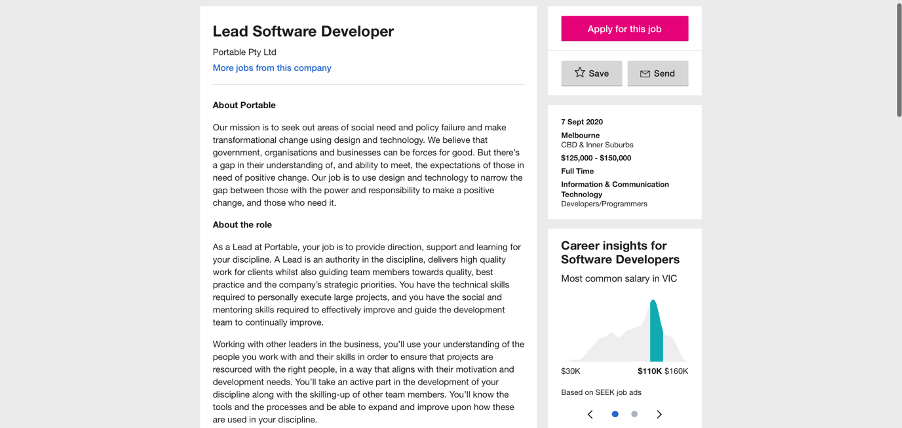

# ProgrammingAss1
Assignment 1 programming 

<!DOCTYPE html>
<html>
<title>W3.CSS Template</title>
<meta charset="UTF-8">
<meta name="viewport" content="width=device-width, initial-scale=1">
<link rel="stylesheet" href="https://www.w3schools.com/w3css/4/w3.css">
<link rel='stylesheet' href='https://fonts.googleapis.com/css?family=Roboto'>
<link rel="stylesheet" href="https://cdnjs.cloudflare.com/ajax/libs/font-awesome/4.7.0/css/font-awesome.min.css">

<body class="w3-light-grey">

<!-- Page Container -->

  <!-- The Grid -->
  

  
   <!-- Left Column -->
    

    
      

        

          
          

            <h2>Jarrah</h2>
          

        

        

          
<i class="fa fa-briefcase fa-fw w3-margin-right w3-large w3-text-teal"></i>Student: S3871483

          
<i class="fa fa-home fa-fw w3-margin-right w3-large w3-text-teal"></i>Melbourne

          
<i class="fa fa-envelope fa-fw w3-margin-right w3-large w3-text-teal"></i>S3871483@student.rmit.edu.au

         
          

          
<b><i class="fa fa-asterisk fa-fw w3-margin-right w3-text-teal"></i>Skills</b>

          
Adobe Photoshop

          

            
90%

          

          
Photography

          

            

              
80%

            

          

          
Illustrator

          

            
75%

          

          
Media

          

            
50%

          

           

          
<b><i class="fa fa-globe fa-fw w3-margin-right w3-text-teal"></i>Languages</b>

          
English

          

            

          

          
Spanish

          

            

          

          
German

          

            

          

           
        

      
 

    <!-- End Left Column -->
    

    <!-- Right Column -->
    

    
      

        <h2 class="w3-text-grey w3-padding-16"><i class=""></i>Jarrah's Profile</h2>
        

        

        <h2 class="w3-text-grey w3-padding-16">Personal Information</h2>
        

          
        
          

My name is Jarrah Waites. I am a 23-year-old female from Melbourne Victoria. I unfortunately only speak English. I am so jealous of people who are bilingual or trilingual. One of my goals is to learn Auslan as I believe it is a language, we should all be taught.  When sign language is learnt It promotes better awareness for the deaf and hard hearing community. 
<h1></h1>
I have a Batchelor degree in health but hope to expand my knowledge through this introduction of IT.
<h2></h2>
A fact about myself may not know is that I am beyond consumed with watching gymnastics. Although I have no experience in the sport whatsoever, I thoroughly enjoy watching the 90 second floor routine with the anxiousness of if Simone Biles will land her triple double.

          

        

        

          <h5 class="w3-opacity"><b>Interest In IT</b></h5>
          
          
From an early age I saw interest in Information Technology (IT) and how it impacted and improved my and others lives around me.  It amazed me how new developments such as the internet, USB and even smart phones quickly became the norm making us reflect how we ever lived without this technology. I was not even in primary school when I would beg my mother and father to jump on their computer to play games. Later in my schooling years 11 and 12 VCE for English we would have to read upwards of two or three novels a year. I was never a great reader, so I opted to audible. By having an alternative, it allowed me to think deeply that education, social interaction and life didn’t have to be as black and white as we all originally thought. Opening my real passion into IT. 
From this moment on I began to get heavy involved in teaching myself anything useful in IT. If a family member or friend had an issue with anything IT I would make it my mission to do as much research as possible to fix the problem with frequently succeeding. 
<h6 class="w3-opacity"><b>Why did you choose to come to RMIT</b></h6>

I didn’t have a gap year after my year 12 studies, and I will admit this is one of my biggest regrets to date. I went straight into a Batchelor degree in Health Science- Public Health at Latrobe University. After finishing the degree, I struggled to find a job that really stood out to me. After looking at endless job applications I came to the harsh realisation that I just completed a degree which I had minimal interest in.  
After finishing this degree in early November 2019 unlike my peers who were obtaining job proposals or applying for masters, I decided to take a gap year.  This is how I rediscovered my interest in IT. 
I looked at both Latrobe University and RMIT to commence studies, but I loved how RMIT offered a two-subject introduction to Batchelor Of IT. The two subject introductions will allow to slowly be reintroduced to the world of academia. 
<h6 class="w3-opacity"><b>What do you expect to learn in IT?</b></h6>

I expect to learn essential skills for IT that will allow me to work in web and mobile computing, security and cloud computing or system administration. When enrolling into this degree these were three specialisations that stood out to me which was the motivation to enrol.  

          

        

        

         

        <h2 class="w3-text-grey w3-padding-16">Ideal Job</h2>
        

         
          
          

          <a href=" https://www.seek.com.au/job/50523099?type=standard#searchRequestToken=29178899-3a2b-40d4-b6a0-5b91bca9e92c">Seek Job listing/Lead software developer</a>
         
<h6 class="w3-opacity"><b></b></h6>
This position is a software developer leader position that will expect the adequate candidate to execute large projects and overview a team. This position will expect the applicant to have exceptional mentoring skills to effectively improve and guide the team to frequently improve. Software development includes designing, researching and managing new software programs. This can also include writing and implementing code.
This position particularly incorporates working closely with other developers to essentially provide an end result.
This position is appealing to me as I have always considered myself a leader. It is something that comes extremely natural to me. After reading this job application it really resonated with me. My goal in this degree is to end up working in software design and I can imagine myself eventually working in the space.

To be an adequate candidate for this position the requirements would be 
<h1></h1>
-	Batchelor in information technology and or software engineering
<h2></h2>
-	3+ years’ experience in software development 
<h3></h3>
-	Demonstrated knowledge in front end, API, CMS websites, infrastructure/Dev-ops
<h4></h4>
I currently have no professional experience in the IT industry, although within this position I have experience mentoring. Although through captainship at school and within high level sport I know how to lead by example, keep others motivated, give constructive criticism and have a challenging conversation when its necessary.  I believe these are skills that can’t be taught yet have to a degree come naturally.
<h5></h5>
To obtain the qualification to be a successful candidate for this position I would need to complete a Batchelor of IT or Computer Science and an additional degree of Batchelor of Software engineering or a Diploma in software. I would need sufficient work experience with a minimum requirement of 3+ years.

<h2>HTML Image</h2>

<h3>HTML Image</h3>

<h4>HTML Image</h4>

<h5>HTML Image</h5>

 
 
        

      

      

        <h2 class="w3-text-grey w3-padding-16"></i>Profile</h2>
        

          <h5 class="w3-opacity"><b>Myer-Briggs</b></h5>
          
          
The Myers-Briggs test identified that I was a Consul personality.  This personality involves strong practical thinkers, loyalty, empathetic and good at communicating with others. Consul weaknesses include inflexible, reluctant to improvise or innovate, vulnerable to criticism and too selfless. Consuls are known to base their moral compass on traditions and laws. Although Consuls do have good values to follow the rules, they often do not realise that what is “right” is not necessarily the truth. (Jung, 2020)
<h1></h1>
The Myers- Briggs test has definitely got my personality right here. I am known by others to be a very practical person who is loyal and empathetic. I am a great communicator who will have a conversation even if that means diving headfirst into conflict with the motive to resolve it. 
When working in a team as a consul I think It is crucial to be self-aware of the weaknesses of this personality.  I need to be cautious of my flexibility and remember that not always things are planned and if something is out of the ordinary, I need to adapt. Additionally, it is important to be open minded to criticism. The test was accurate that consuls can be sensitive I agree regarding myself. This is something that I will have to keep an open mind about and remember that criticism is not personal rather professional.

 
          <h5 class="w3-opacity"><b>Learning Styles</b></h5>
          
 The learning style test indicated that I was a visual learner. A visual learner learns by seeing pictures or reading and understands and remembers things by sight. (Pourhosein Gilakjani, 2011). The adverse aspects of a visual learner can include difficulty to listen to direction and information that is not written out. This may eventuate to difficulty in learning in a big group as visual learners can often require instructors to repeat themselves. The disadvantages of being a visual learner can include difficulty when only text and speeches are available for learning.
<h2></h2>
Being a visual learner in the workplace or a team will have its benefits and its disadvantages. From a positive mindset we live in a modern world were technology is used for almost everything. When learning content never has anyone had access to more graphs, maps, diagrams, and charts to communicate new data. This in effect making it easier for a visual learner to consume and understand content. Additionally, in a team environment a visual learner is known to have an excellent memory which allows them to apply what they have learnt in the classroom to a project. 
The disadvantages of a visual learner in a team or a workplace can include easily distracted and not understanding a written task immediately. 

<h6 class="w3-opacity"><b>Big Five Personality Test</b></h6>

 Lastly the big five personality test measures your assessment on five core dimensions of your personality. Openness, conscientiousness, extraversion, agreeableness, and neuroticism (OCEAN)
<h6></h6>
-	Openness indicates an individual’s tendency to think differently in abstract and complex ways. According to the big five personality test I am more able than the average person to connect seemingly unrated concepts
<h7></h7>
-	Conscientiousness describes a persons ability to self-discipline in  order to peruse goals. The test indicated I am average for this category.
-	Extraversion is the inclination to seek stimulation for the outside world. I tested above average for this.
<h8></h8>
-	Agreeableness is a person’s tendency to put other needs ahead of their own. And to work with others do not compete. This was my highest scoring attribute. 
<h9></h9>
-	Neuroticism describes a person’s tendency to experience negative emotions including fear, anxiety, and guilt.
The findings from this personality test were a surprise. Especially the dimension of neuroticism. I believe I am an insanely anxious person who is very emotional at times.
<h1></h1>
In a team environment I think that openness, conscientiousness, and agreeableness will be strong attributes to bring to a group. The downfall in many group situations is effective communication, with a personality attribute of openness allows for me to be extremely approachable. With conscientiousness indicating that I will self-discipline and work hard until the work is completed. 
<h2></h2>
The negative attributes this test shows is agreeableness. Although above I indicated that it was a strong attribute, I do not want to discredit it from being a double end sord.  Agreeableness can often be a negative as you afraid to start conflict and just go the easy route. Additionally, I see extraversion as a downfall as it can make me focus on validation from other group members therefore getting distracted from the task at hand. 

<h2 class="w3-text-grey w3-padding-16"></i>Project Idea</h2>
        

        
          <h5 class="w3-opacity"><b>Overveiw</b></h5>  
          
 This project will be a smart phone application that functions as a mental health protection for young adolesce aged between (13-17). The application titled “SmileBlue” will be targeted at parents with children in this age bracket. The application will be downloaded on the teenager’s phone. The parent will then be notified via a notification if the adolescent uses certain key words that are concerning.
E.g. Kill myself, cutting, suicide, overdose etc. 
<h1></h1>
This when then allow the parent to intervene with the child’s mental health therefore picking up behaviours that may have been overviewed previously. 

            <h5 class="w3-opacity"><b>Motivation</b></h5>    
            
 The motivation for this mobile application comes from the devastating statistics of teenage mental health disorders, self-harm, and suicide. According to the Black Dog institute adolescence (13-19) have the highest prevalence of mental health from any other age group, (Facts & figures about mental health, 2020) additionally suicide is the second biggest killer in this age group closely behind skin cancer. (Skyes, 2020) 
From 2009-2017 depression surged 69 percent, anxiety jumped 71 percent and suicide doubled. This does not include attempts. (Twenge, 2020)
<h2></h2>
In Australia, professional confidentially legally can not be broken unless the patient is deemed to be a threat to themselves or others. (What is age and confidentiality? 2020)  However not every adolescence has initiative or is comfortable to ask for help to begin with. Therefore, damaging behaviours aren’t picked up until they are potentially too late. 
<h3></h3>
Before the internet suicide and self-harm were known to be very black and white. The way someone could hurt themselves was a handful of options. Although these options may still be the most common for someone to harm themselves the internet has allowed others to communicate with each other and share “tricks”.
This application is needed. As technology progresses the amount of bullying sky rockets, depression inflates, self-harm increases and unfortunately suicide doubles.(Twenge,2020)  SmileBlue will allow parents who care about there children to intervene before a potentially devastating outcome occurs.

              <h5 class="w3-opacity"><b>Descripton</b></h5> 
              The application “SmileBlue”, is a monitory mental health application for parents of children aged between 13-17. SmileBlue aims for parents to monitor children’s mental health without being invasive to their personal privacy. Many parental control applications for parents have been created such as Life360, web watcher and even google family.  The difference between SmileBlue and these applications listed is the freedom the adolescent has on their own device. SmileBlue is like a Big brother/ Big sister they do not spy on their sibling rather just help parents look out for them. So, what is SmileBlue?
<h3></h3>
SmileBlue is a smart phone application. It cwill be accessed through the application store. The category SmileBlue will be allocated under “lifestyle.” This application will need to be downloaded on the guardian’s device and the adolescence device.
<h4></h4>
On instillation two separate settings will prompt “guardian” or “adolescence”. When the guardian setting is selected the child’s device will need to be synced to their application. This will ensure that both devices are communicating. Once the youth’s device has been synced there is nothing else needed, SmileBlue is downloaded and working.  
<h4></h4>
The parent’s device on the other hand will need more information to be effective to protect their teen. There will be a main section in SmileBlue called “track it,” this is where parents need to fill out key words or phrases. 
<h4></h4>
Promted key words and phrases include
<h4></h4>
-	Depression
<h4></h4>
-	Suicide
<h4></h4>
-	How to kill yourself
<h4></h4>
-	Painless suicide 
<h4></h4>
-	Suicide chat
<h4></h4>
-	Painless self-harm
<h4></h4>
-	Suicide methods 
<h4></h4>
These phrases and words are not selected at random rather found in the United States to be the most common things googled by someone struggling with mental health and contemplating self-harm or suicide. (Tran et al., 2017)<h4></h4>
If these phrases or key words are used by the adolesce a notification will be sent to the guardian phone alerting there is concern for safety. Additionally, SmileBlue will scan webpages to find key words as they could be perceived as mental health triggers and similarly send a notification to the guardians phone if there is concern for safety. 
<h4></h4>
Smileblue will require a monthly update for the application, this will provide new key words that are circling around the internet regarding mental health. SmileBlue understands that as an application it will need to adapt and improve to stay helpful and relevant to guardians. 
Smileblue will require a monthly update for the application, this will provide new key words that are circling around the internet regarding mental health. SmileBlue understands that as an application it will need to adapt and improve to stay helpful and relevant to guardians. 
<h4></h4>
An adolecence might not want to feel as if they are being monitored via this application. Therefore, personally wanting to delete SmileBlue off their device. Consequently, a feature in advance settings on the guardian’s phone prevents user from deleting the application without the guardians password. The uninstallation will require a twostep verification process.  At SmileBlue we understand that teenagers are very tech savvy.
              
                <h5 class="w3-opacity"><b>Tools and Technology</b></h5> 
                

                To get this application from idea to operatable a program called “MIT App Inventor(MIT)” will be used. MIT App Inventor is a visual programming environment that makes the creation of applications uncomplicated and timeless. This program focuses on taking the complication out of app design and promotes creation. When using MIT for a new project, it provides the creator to design the app user interface, layout, media, and connectivity. To elaborate MIT provides the user to allow speech recognition, music, vertical scroll, horizontal viewing, and internet within the app.
<h4></h4>
When researching application inventors, the selling point for using MIT was the user-friendly approach. The program is marketed for primary and high school students and individuals with no previous application design background.
<h4></h4>
It is to be aware that the MIT inventor helps the user create an app, these applications are not a clean visually appealing application. Rather a draft or first cut appearing app.
This Program would be used as a drafting program not as a finished product. 
<h4></h4>
A finish product would be required through XD adobe.

                  <h5 class="w3-opacity"><b>Skills Required</b></h5> 
                  
 
  MIT does not require any previous programming or computer science skills. The program is designed for beginners. The program requires basic computer skills that will open the user’s perception on app design.
For a final application XD adobe will be used, the designer will need prior knowledge on adobe, grids, wiring artboards and creating prototypes. XD allows an application to be created with seamless imagery. 
                 
                    <h5 class="w3-opacity"><b>Outcome</b></h5>    
                    

 Mental health in teenagers is an epidemic. Parents have been found to struggle in picking up the cues of a change in mental health related behaviours. (Worried about your child's mental health? 2020) With implementation of SmileBlue it will immediately indicate to guardian if their child is being bullied thinking or participating in self harm and having suicidal thoughts.
This application will give guardians power over their child’s mental health and allow for early intervention. 
<h4></h4>
The goal is to lower mental health statistics. As a nation we are losing to many teenagers to suicide. Why not create a intervention with a device that is glued to their hip? 

          

        

        

          <h5 class="w3-opacity"><b>Bibliography</b></h5>
          
          
Pourhosein Gilakjani, A., 2011. Visual, Auditory, Kinaesthetic Learning Styles and Their Impacts on English Language Teaching. Journal of Studies in Education, 2(1), p.104.
<h4></h4>
Blackdoginstitute.org.au. 2020. Facts & Figures About Mental Health. [online] Available at: <https://www.blackdoginstitute.org.au/wp-content/uploads/2020/04/1-facts_figures.pdf> [Accessed 15 September 2020].
<h4></h4>
Skyes, A., 2020. Teenage Mental Health. [online] Healthdirect.gov.au. Available at: <https://www.healthdirect.gov.au/teenage-mental-health> [Accessed 15 September 2020].
<h4></h4>
Twenge, J., 2020. The Mental Health Crisis Among America's Youth Is Real – And Staggering. [online] The Conversation. Available at: <https://theconversation.com/the-mental-health-crisis-among-americas-youth-is-real-and-staggering-113239> [Accessed 15 September 2020].
<h4></h4>
Au.reachout.com. 2020. What Is Age And Confidentiality?. [online] Available at: <https://au.reachout.com/articles/what-is-age-and-confidentiality> [Accessed 15 September 2020].
<h4></h4>
Tran, U., Andel, R., Niederkrotenthaler, T., Till, B., Ajdacic-Gross, V. and Voracek, M., 2017. Low validity of Google Trends for behavioral forecasting of national suicide rates. PLOS ONE, [online] 12(8), p.e0183149. Available at: <https://journals.plos.org/plosone/article?id=10.1371/journal.pone.0183149>.

<h4></h4>

Mayo Clinic. 2020. Worried About Your Child's Mental Health?. [online] Available at: <https://www.mayoclinic.org/healthy-lifestyle/childrens-health/in-depth/mental-illness-in-children/art-20046577> [Accessed 16 September 2020].
<h4></h4>
Jung, C., 2020. The Myers & Briggs Foundation - MBTI® Basics. [online] Myersbriggs.org. Available at: <https://www.myersbriggs.org/my-mbti-personality-type/mbti-basics/> [Accessed 17 September 2020].

 
  
Powered by <a href="https://www.w3schools.com/w3css/default.asp" target="_blank">w3.css</a>

</footer>

</body>
</html>

